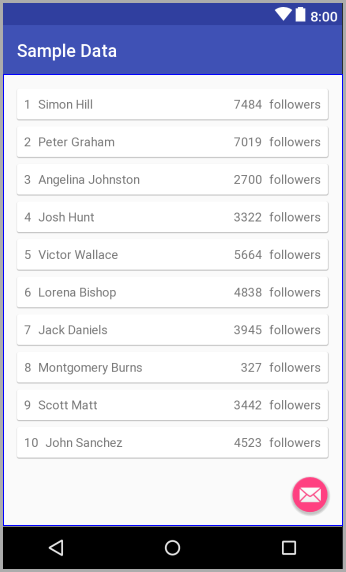

### Android Sample Data With RecyclerView

A simple Android Kotlin project that demonstrates the use of custom sample data in the layout 
editor with RecyclerView.

Using `tools:listItem` in the RecyclerView and `tools:text` in the list item layout allows the 
Android Studio layout editor to render a RecyclerView using mocked data instead of random lines of 
"List Item".

For more information see the Android Developer [Tools Attributes Reference](https://developer.android.com/studio/write/tool-attributes#toolssample_resources) guide.